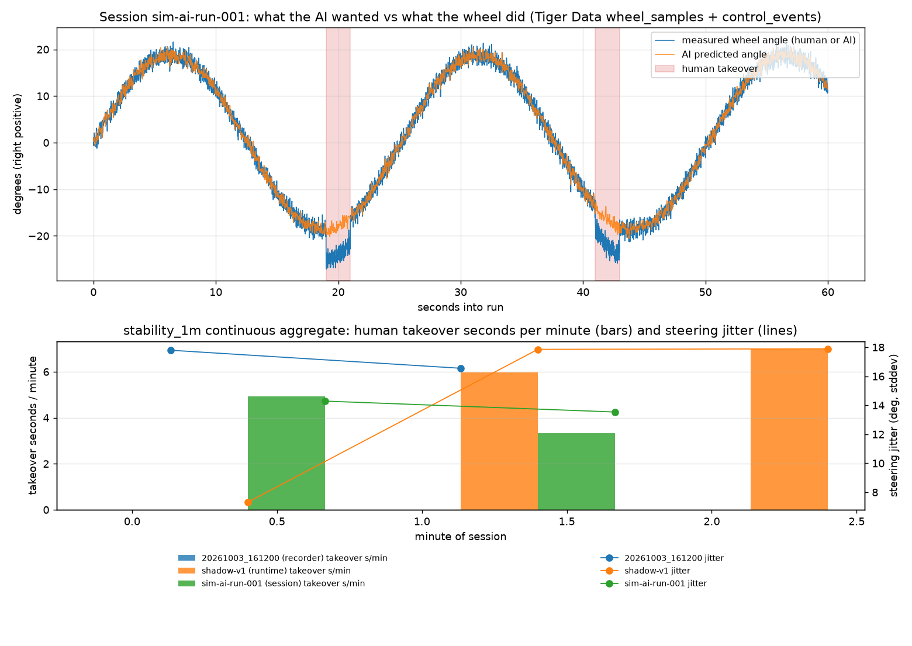

# Driving analytics on Tiger Data

Tiger Cloud is hosted PostgreSQL with the TimescaleDB extension. The analytics
package loads the CSV files the recorder and runtime already write into one
hypertable and rolls them into a continuous aggregate, so the evaluation metrics
from the README (interventions, steering stability, tracking error) are plain
SQL instead of ad hoc scripts. It is analytics only: the control loop, training,
and inference never read from or write to the database, and no image pixels
are stored (rows keep an `image_path` pointer to the JPEG on disk).

## Setup

1. Create a Free Plan service in [Tiger Console](https://console.cloud.tigerdata.com/)
   (2 services per account, 750 MB each, read-only when full; an hour of 60 Hz
   rows is roughly 20 MB). Download the config when prompted; the password is
   shown once.
2. Copy `.env.example` to `.env` and set `TIGER_DATA_URL` to the service URL.
   `.env` is gitignored. `--url` or the environment variable also work.
3. Install and create the schema:

```sh
python -m pip install -e '.[analytics]'
forza-analytics init
```

`init` is idempotent and safe to rerun after upgrades. It creates:

- `wheel_samples`: hypertable keyed by `time`, with `session`, `source`,
  `mode` (`manual`/`assist`/`takeover`/`fault`), measured `steer_deg`,
  controller `target_deg`, policy `predicted_deg`, `torque`, `speed_mps`,
  pedals, `race_on`, `obs_age_ms`, `yaw_rate`, `gear`, `rpm`, `game_ms`.
  Columns a source does not provide are null. Compression policy after one day.
- `control_events`: hypertable of control hand-offs from stream-v1 sessions
  (`control_mode`, `training_mode`, `expert`, `reason`). This is the
  authoritative takeover record.
- `run_reports`: one row per runtime run from `--run-report` JSON
  (`actuation`, mode durations, interventions per assisted minute, tracking
  RMSE, route markers, error) plus the full document as JSONB.
- `stability_1m`: continuous aggregate per session, source, and one-minute
  bucket with mean absolute steering, steering jitter, tracking error,
  takeover/assist sample counts, and speed.

## Load data

There are three real data sources. Each `source` value marks where rows came from.

| Source | Produced by | Command |
| --- | --- | --- |
| `recorder` | Standalone `python record.py record` human laps: `meta.json`, `labels.csv`, `frames/` | `load-recording DIR` |
| `session` | Integrated runtime recording `forza_ai.runtime --record-session DIR` (stream-v1: `metadata.json`, `wheel.csv`, `telemetry.csv`, `events.csv`) | `load-session DIR` |
| run report | `forza_ai.runtime --run-report FILE.json` summary of any run | `load-report FILE --session NAME` |
| `runtime` | `--status-csv` tick log; finite test runs only, refused for unlimited runs | `load-run FILE` |

```sh
# Human lap from the standalone recorder
forza-analytics load-recording data/recordings/20261003_161200

# AI run with human corrections, recorded by the runtime itself, plus its summary
forza-analytics load-session data/sessions/assist-001 --session assist-v1
forza-analytics load-report runs/assist-001/report.json --session assist-v1
```

Use the same `--session` name for a run's session and report so they line up.
Reloading a session replaces its rows (and its control events), so repeated
loads are safe; `--append` keeps existing rows. Reloading a report replaces it.

Details and limits:

- `load-recording` requires the original twelve `labels.csv` columns as a
  prefix; the newer diagnostic columns (`yaw_rate`, `gear`, car fields) are
  accepted and `yaw_rate`/`gear` are stored. Every row is `mode = manual`.
- `load-session` refuses a session whose `metadata.json` is not
  `completed: true` unless `--allow-incomplete` is given. `wheel.csv` is the
  sample stream; its `control_mode` column is the *training label* (the
  recorder writes every non-expert sample as `assist`), so the stored `mode`
  is the true mode from the latest preceding `events.csv` entry. Telemetry is
  joined causally (latest sample at or before each wheel timestamp). When the
  session was recorded with `run-ai.ps1 -Record`, `predictions.csv` is joined
  the same way (by `generated_time_ns`) and fills `predicted_deg`,
  `target_deg`, `predicted_gas`, and `predicted_brake`, including during human
  takeovers. Sessions without that file load with those columns null.
- `load-report` flattens the runtime summary; `actuation` is `motor` or
  `direct_vjoy`. Do not compare interventions or tracking across actuation
  modes: in direct-vJoy mode no motor holds the wheel and turning past the
  override angle counts as a takeover.
- Wall-clock times: recorder rows are anchored to the `YYYYMMDD_HHMMSS`
  directory name in local time; session and status rows are anchored so the
  last sample lands on the file modification time (or `--end-time`). All
  sources use relative or monotonic clocks, so these times are for charting
  and grouping, never cross-machine comparison.

## Report

```sh
forza-analytics report                      # runs, per-session summary, per-minute rollup
forza-analytics report --events             # also control hand-offs and inferred takeover onsets
forza-analytics report --session assist-v1  # restrict per-minute and event listings
```

The SQL behind the report lives in `src/forza_ai/analytics/report.py` and can be
pasted into the Tiger Console SQL editor or any Postgres client.

- **Interventions:** `run_reports.per_assist_min` is the runtime's own count of
  explicit human takeovers per assisted minute. `takeover_pct` and
  `takeover_samples` measure time spent in takeover from the samples.
  `control_events` lists each hand-off with its reason.
- **Tracking:** `tracking_err_deg` (status CSV) or `run_reports.tracking_rmse_deg`
  shows how closely the wheel followed the model's target. Lower is better.
- **Stability:** compare `steer_jitter_deg` between a `recorder` human lap and a
  `session` AI run on the same route.
- **AI vs human:** the disagreement table groups rows that have a prediction by
  `mode`. In `assist` it is tracking error; in `takeover` it is how far the
  human steered from what the AI wanted. `mean_signed_deg` shows the direction
  of the bias and `human_over_ai_ratio` is the gain the human applied relative
  to the model (a ratio above 1 means the model understeers).
- **Model comparison:** load each model's run under its own session name; the
  Runs table then reads as a leaderboard.

## Insights: why did the human take over?

```sh
forza-analytics insights                    # all AI runs
forza-analytics insights --session ai-v1    # one run
```

Six hypothesis queries (`src/forza_ai/analytics/insights.py`), each mapped to
a knob that already exists in `run-ai.ps1` or training:

| | Question | Knob |
| --- | --- | --- |
| H1 | During takeovers, how much more does the human steer than the AI asked? | `--steering-gain` (the ratio is the candidate value) |
| H2 | Do takeovers and disagreement rise above some speed? | `--max-speed-kmh`, `--corner-speed-kmh`, `--brake-gain` |
| H3 | Are takeovers concentrated in left or right corners? | DAgger-record that side (`run-ai -Record`), retrain |
| H4 | Does the AI react late? (prediction vs human angle shifted in time) | `--label-offset-ms`, target slew |
| H5 | Which steer/speed cells have many takeovers but little human training data? | record more laps there |
| H6 | What triggered each takeover (button, grab, pedal)? | controller limits vs model errors |

H1, H2 and H4 need `predicted_deg`, so the run must have been recorded with
`-Record` (predictions.csv) or logged with `--status-csv`. H3 and H6 read
`control_events`; H5 compares AI runs with `recorder` human laps. The intended
workflow: load run v1, read the clearest signal, turn that knob, re-run the
same route as v2, and compare the two rows in the Runs table.

Read H4 after H1: an amplitude bias makes the lag curve monotonic (no clear
minimum), so the lag estimate is only meaningful once the gain is roughly right.
H4 also assumes ~10 ms sample spacing and pairs rows across non-contiguous
human segments, so treat it as approximate. Verified on a simulated session with
a planted 0.75x understeer: H1 reported `human_over_ai_ratio` 1.33.

## Demo chart

```sh
python scripts/analytics_chart.py --ai-session SESSION --out docs/assets/tiger-analytics.png
```

Top panel: measured wheel angle against the AI's predicted angle for one AI
session, with human takeovers shaded from `control_events`. Bottom panel:
`stability_1m` takeover seconds per minute and steering jitter for every loaded
session. The committed image was rendered from simulated sessions, not a real
drive.



Tests in `tests/analytics` cover CSV/JSON conversion, the causal joins, and
schema parsing with fakes and need no database. The live path was exercised
against a Tiger Cloud free service with a synthetic `record.py` lap, a stream-v1
session written by `forza_ai.recording.SessionRecorder`, and a `--run-report`
from the simulated runtime.
