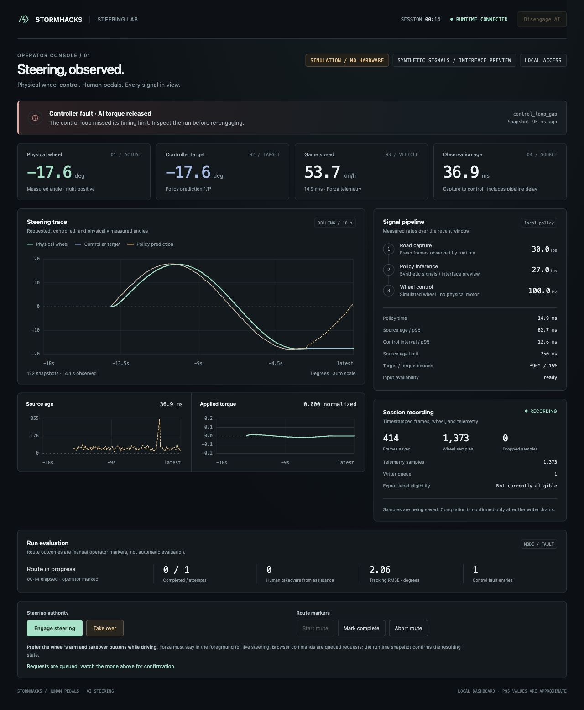

# Operator workflow

The runtime now provides wheel re-engagement, integrated human-correction
recording, a local dashboard, run reports, and saved launch profiles. These can
be exercised with synthetic inputs before a real dataset/model is ready.

## Setup and launch

Follow [TWO_PC_SETUP.md](TWO_PC_SETUP.md) for the machine roles, shared LAN key,
device checks, and initial stationary acceptance. Training coordination stays
in the existing Codex chats; there is no new training orchestration service.

Copy the examples described in [configs/README.md](../configs/README.md) to
`*.local.json`. Those local files are ignored by Git. Fill the actual desktop
IPv4, capture configuration, model export or fixed-test mode, and verified
wheel button indices. Profile paths are relative to the profile directory.

```powershell
python -m forza_ai.launch doctor --role desktop
.\scripts\start-desktop.ps1 -Profile .\configs\desktop-test.local.json -Check
.\scripts\start-game.ps1 -Profile .\configs\game.local.json -Check
```

Omit `-Check` to launch. The game example starts in shadow mode, so AI torque
and arm requests are disabled. Use profile mode `manual` to allow explicit
engagement, or explicitly choose `assist` after hardware acceptance. Each launch
creates a unique run directory with a redacted configuration manifest and report.
Passwords and the LAN key belong only in the process environment, not profiles.

## Wheel and operator controls

- **Takeover button:** removes AI torque immediately. A fresh explicit takeover
  declares a human correction; merely losing a model/network input does not.
- **Arm button:** a rising edge requests engagement. Holding it cannot re-arm
  after a fault, and a button already held at startup is ignored. Takeover wins
  if arm and takeover are pressed together.
- **Route button:** a rising edge starts a route attempt; the next press marks
  completion. These are operator annotations, not automatically inferred laps.
- **Console/dashboard:** `arm`, `manual`, `route_start`, `route_complete`, and
  `route_abort` request the same actions. `quit` or Ctrl+C ends the runtime.

Configure `--takeover-button`, `--arm-button`, and `--route-button` with distinct
zero-based SDL indices. Reserved control buttons must not also be mapped to game
actions. Re-engagement waits up to five seconds for a valid command. An arm
request while already assisted does not survive a later fault.

## Live dashboard

`--dashboard-port 8766` serves a loopback-only dashboard at
`http://127.0.0.1:8766`. It shows wheel/target/policy angles, source observation
age, inference duration, control state, intervention count, route markers, and
recording/transport status. Stale snapshots visibly disable controls. Requests
are queued for the runtime; HTTP threads never write to the motor.

The redesigned view includes timestamp-scaled steering, source-age, and torque
traces with toggles/tooltips; observed capture/prediction/control rates; latency
percentiles; control limits; and readable recording health. Rates are measured
over a rolling two-second window and remain unknown during warm-up or when a
source is absent. Remote prediction time includes the network round trip.
Simulation, shadow, fault, stale, and disconnected states are explicitly distinct.
The sticky header keeps Disengage AI visible while scrolling. A queued request
is shown as confirmed only after a subsequent fresh runtime snapshot supports it.

Keep the game foreground during assisted driving. Inspect the dashboard on a
second screen without taking focus, or use the physical buttons. Clicking the
browser causes the foreground guard to disengage AI; an arm request gives you
time to return to the game. The dashboard is not exposed on the LAN.

Local simulation preview (no wheel or dataset):

```sh
python -m forza_ai.runtime --backend sim --assist --sweep --duration 30 --dashboard-port 8766 --run-report /tmp/demo-report.json
```

This screenshot is from simulated hardware, not a physical driving result:



[Narrow-screen preview](assets/dashboard-mobile-preview.jpg). The screenshots
use synthetic signals, including a deliberately visible latched fault state;
they are not evidence of physical driving or hardware acceptance. The review
findings, implemented fixes and verification limits are in [HARNESS_REVIEW.md](HARNESS_REVIEW.md).

## Integrated recordings and human corrections

Enable `--record-session NEW_DIRECTORY` (or profile `recording.enabled`) to
record frames, wheel samples, telemetry, and control provenance in the same
process as assistance. The recorder is asynchronous and bounded. It does not
open a second wheel or telemetry listener.

`--record-manual` explicitly labels initial manual driving as expert examples.
Use it for human demonstrations, not to relabel AI-generated motion. For a
correction run, leave it off: only an explicit human takeover becomes expert
data. The first 100 ms after zero AI torque is written are excluded by default
(`--takeover-settle-ms`). Eligibility uses the wheel sample timestamp, and cached
frames from before the human-control boundary are excluded.

Automatic timeout/fault disengagements remain nonexpert. Assistance samples may
be retained for diagnostics but the training loader rejects them. A recording
with no human corrections can therefore be complete but have zero trainable
samples. Validate before adding it to a dataset.

The output is stream-v1 (`metadata.json`, `frames.csv`, `wheel.csv`,
`telemetry.csv`, PNG images, and an events sidecar). It loads directly; do not
run the legacy importer on these sessions. Queue drops, writer failures, and
incomplete shutdown keep `completed: false`. Ctrl+C is a normal recording stop
when the writer drains successfully, and hardware cleanup precedes that drain.

Manual collection without a trained model:

```powershell
python -m forza_ai.runtime --backend windows --shadow --capture-config config/capture.json --takeover-button BUTTON_INDEX --record-session data/sessions/manual-001 --record-manual --duration 0 --dashboard-port 8766 --run-report runs/manual-001.json
```

Capture defaults to 30 fresh frames/sec; inference remains independently paced.
Actual achieved rates depend on the game, drivers, and storage. Sessions should
span separate recording runs for independent train/validation groups.

## Run reports and comparisons

`--run-report PATH` stores bounded aggregates even for unlimited runtime
duration: explicit human interventions per assisted minute, mode durations,
assisted tracking RMSE, source-age/inference/control-gap percentiles, and route
markers. Percentiles use a fixed histogram and are labelled approximate.
Inference samples are deduplicated by prediction ID; observation age is sampled
per control tick. Reports do not turn manually marked completion into proof of
autonomous route success.

```powershell
python -m forza_ai.metrics report runs/run-001/report.json runs/run-002/report.json
python -m forza_ai.metrics report runs/run-001/report.json --json
```

`--status-csv` remains an optional detailed finite-run log (at most 100,000 ticks).
Saved profiles select it only when the run is suitably bounded. Cleanup faults
and recorder completion status are included in the report.

## Legacy recorder: fresh 30 FPS default

`python record.py record` defaults to `--fps 30` per the latest user preference;
explicit `--fps` overrides (including 60) remain supported. It uses paced one-shot
`new_frame_only` capture and skips `None` results rather than reusing a cached
image. `meta.json` reports measured fresh/saved FPS, elapsed time, gaps, inactive
frames, and queue drops. Requested FPS is not a guarantee of achieved FPS.

Legacy `labels.csv` columns and rounded post-retrieval timestamps remain
compatible. New `capture_timing.csv` retains integer host capture-start,
retrieval, wheel-poll, and telemetry-receive timestamps. These are not GPU render
or USB hardware timestamps. Keep the full original recording directory: the
legacy importer continues to use its conservative aligned labels, not the new
timing sidecar. The integrated recorder above supplies the stream-v1 route for
new correction datasets.
